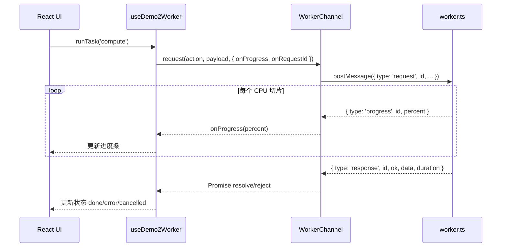

# Demo2：Hook + Channel + Worker 架构说明

> 目标：在 React 页面中安全地使用 Web Worker 承载 CPU 密集任务，保持主线程流畅，并让并发任务、进度上报、取消、超时都可控。

## 1. 这个 Demo 解决什么问题？

`compute` 任务是 CPU 密集型（示例中用空转切片模拟），如果放在主线程会卡 UI。

Demo2 的方案是：

- 主线程只负责 UI 与状态管理。
- 计算放到 Worker。
- 用统一消息协议通信。
- 用 `WorkerChannel` 统一处理请求/响应、超时、取消、错误。
- 用 `useDemo2Worker` 封装页面可直接消费的状态与动作。

---

## 2. 文件分工（按职责）

```text
src/views/test/demo2/
├─ types.ts                 # 双向消息协议（主线程 <-> Worker）
├─ worker.ts                # Worker 侧任务执行与消息处理
├─ WorkerChannel.ts         # 主线程侧通信适配层（可靠请求通道）
├─ hooks/
│  └─ useDemo2Worker.ts     # 页面状态编排层（任务列表、取消、清理）
├─ components/
│  ├─ TaskComposer.tsx      # 发起任务
│  ├─ TaskList.tsx          # 展示任务与取消按钮
│  └─ WorkerStatusBar.tsx   # Worker 就绪状态与运行计数
└─ index.tsx                # 页面装配层
```

一句话：

- `worker.ts` 只管“做事”。
- `WorkerChannel.ts` 只管“通信可靠性”。
- `useDemo2Worker.ts` 只管“业务状态编排”。

---

## 3. 整体时序（一次 compute）



---

## 4. 为什么要拆成 Hook + Channel + Worker？

### 4.1 `worker.ts`（执行层）

- 聚焦任务执行逻辑。
- 不关心 React 状态。
- 支持：
  - `init` 就绪握手
  - `request` 任务执行
  - `cancel` 软取消
  - `progress` 进度上报

这样 Worker 能专注于逻辑，无需关心页面渲染等其他内容。

### 4.2 `WorkerChannel.ts`（通信层）

- 为每个请求分配自增 `id`，实现请求-响应配对。
- 维护 `pending` 映射，集中管理：
  - Promise resolve/reject
  - 请求超时
  - 进度回调
- 处理 Worker 异常：`onerror` / `onmessageerror`。
- 提供 `ready`、`request()`、`cancel()`、`terminate()` 稳定 API。

这样页面不需要直接写 `worker.onmessage = ...` 这类脆弱模板代码。

### 4.3 `useDemo2Worker.ts`（编排层）

- 管任务列表、状态流转、提示文案。
- 维护 `UI id -> Worker id` 映射，支持从列表按钮取消任务。
- 封装生命周期：挂载初始化、卸载终止、避免卸载后 setState。

这样组件层只拿到“可直接用”的接口： `{ tasks, isWorkerReady, runTask, cancelTask, clearTasks }`。

---

## 5. 关键设计点

### 5.1 协议先行（`types.ts`）

先定义判别联合（`type` 字段区分），再写通信逻辑。优点：

- 编译期保证消息结构正确。
- 主线程与 Worker 双端共享同一协议，减少“口头约定”。

### 5.2 软取消而不是硬中断

`cancel` 并不立刻杀 Worker，而是从 `activeTasks` 中移除目标 id。Worker 在切片检查点发现后退出。

优点：

- 简单可靠，不会误伤同 Worker 内其他任务。
- 可与并发切片模型自然配合。

### 5.3 切片 + 让出事件循环

`compute` 被切成多个 100ms 小片，每片结束后优先使用 `scheduler.postTask(() => {}, { priority: 'background' })` 让出调度；若运行环境不支持 Scheduler API，则自动降级为 `setTimeout(0)`。

优点：

- `cancel` 消息能及时被处理。
- 多个 compute 能交替推进。
- 主线程输入与交互保持流畅。

### 5.4 资源回收闭环

- 每个请求完成后清理 timeout + pending。
- 任务结束后清理 `UI id -> Worker id` 映射。
- 页面卸载时 `terminate()`，避免悬挂 Worker。

---

## 6. 什么时候用这套结构？

适用：

- 前端需要执行明显 CPU 密集任务（解析、压缩、加密、批量转换）。
- 任务有并发、可取消、要看进度。
- 同类能力会在多个页面复用。

不适用：

- 只有一次性非常轻量计算（复杂度低、耗时极短）。
- 完全无状态、无并发需求的小脚本型逻辑。

---

## 7. 设计心法

先把 **执行**（Worker）、**通信可靠性**（Channel）、**业务状态**（Hook）解耦，再通过严格协议拼起来。这样代码会更稳、更容易扩展，也更适合团队协作。
