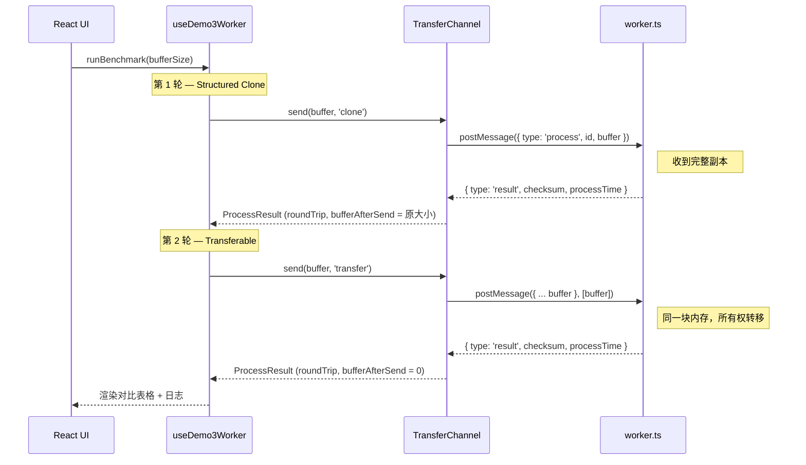

# Demo 3 — Transferable Objects

> 目标：通过交互式基准测试，直观对比 `postMessage(msg)`（Structured Clone）与 `postMessage(msg, [buffer])`（Transferable）两种数据传输方式的性能差异，理解 Transferable 的零拷贝原理及其适用场景。

## 1. 这个 Demo 解决什么问题？

Web Worker 通信默认使用 **Structured Clone**：浏览器将数据序列化 → 复制 → 反序列化，传输开销与数据量成 O(n) 线性关系。当传输大型 ArrayBuffer（如图像、音频、文件切片）时，拷贝开销可达数十毫秒甚至更高。

Demo3 演示了另一种方式——**Transferable Objects**：通过 `postMessage(msg, [buffer])` 将 ArrayBuffer 的所有权以 ≈ O(1) 的开销转移给 Worker，**不复制任何数据**，但发送后主线程的 buffer 会变为 detached（不可用）。

---

## 2. 核心概念

| 特性         | Structured Clone         | Transferable Objects         |
| ------------ | ------------------------ | ---------------------------- |
| **API**      | `postMessage(msg)`       | `postMessage(msg, [buffer])` |
| **内存行为** | 序列化 → 复制 → 反序列化 | 零拷贝，所有权转移           |
| **发送后**   | 发送方仍可使用原数据     | 发送方 buffer 变为 detached  |
| **性能**     | O(n)，随数据量线性增长   | ≈ O(1)，与数据量几乎无关     |
| **安全要求** | 无特殊要求               | 无特殊要求                   |
| **适用场景** | 小数据 / 需要保留原数据  | 大数据一次性转移             |

### 与 SharedArrayBuffer 对比

| 特性         | Transferable Objects       | SharedArrayBuffer             |
| ------------ | -------------------------- | ----------------------------- |
| **所有权**   | 转移（主线程失去访问权）   | 共享（双方同时拥有）          |
| **内存**     | 同一块内存，但只能一方访问 | 同一块内存，双方同时访问      |
| **同步需求** | 无需同步（独占访问）       | 需要 Atomics 同步（竞态风险） |
| **使用后**   | 发送方无法再使用           | 双方都可持续读写              |
| **安全要求** | 无特殊要求                 | 需要 COOP/COEP 响应头         |
| **典型场景** | 大数据一次性转移           | 持续协作、频繁更新            |

---

## 3. 文件分工（按职责）

```text
src/views/test/demo3/
├─ types.ts              # 双向消息协议（主线程 <-> Worker）
├─ constants.ts          # 预设 buffer 大小、格式化工具、模式描述
├─ worker.ts             # Worker 侧：接收 buffer → 计算校验和 → 返回结果
├─ TransferChannel.ts    # 主线程侧通信信道（支持 clone / transfer 两种模式）
├─ hooks/
│  └─ useDemo3Worker.ts  # 页面状态编排：Worker 生命周期 + 基准测试 + 日志
├─ components/
│  ├─ BenchmarkControl   # 控制面板（选择大小、启动测试）
│  ├─ BenchmarkTable     # 对比结果表格
│  ├─ ConceptDiagram     # 原理示意图（Clone vs Transfer 内存行为）
│  └─ TransferLogList    # 传输日志时间线
└─ index.tsx             # 页面装配层
```

一句话：

- `worker.ts` 只管"算校验和"，不感知传输模式。
- `TransferChannel.ts` 只管"通信可靠性 + 传输模式切换"。
- `useDemo3Worker.ts` 只管"基准测试编排 + 日志收集"。

---

## 4. 整体时序（一次对比测试）



---

## 5. 关键设计点

### 5.1 核心差异仅一行代码

```ts
// Structured Clone —— 浏览器复制数据，主线程仍可用
this._worker.postMessage(message);

// Transferable —— 零拷贝转移所有权，主线程 buffer 变为 detached
this._worker.postMessage(message, [buffer]);
```

唯一区别是 `postMessage` 的第二参数：传入 `[buffer]` 即声明将其所有权移交给 Worker。

### 5.2 Worker 无需感知传输方式

Worker 端代码完全相同——它收到的 `ArrayBuffer` 行为一致，无论是通过 Clone 还是 Transfer 传入。传输模式的选择完全由主线程的 `TransferChannel.send()` 决定。

### 5.3 传输开销 = 往返耗时 − Worker 计算耗时

```
传输开销 = roundTrip - processTime
```

- `roundTrip`：主线程 `postMessage` 到收到响应的总耗时
- `processTime`：Worker 内部纯计算耗时

差值即为 `postMessage` 的序列化/拷贝开销——这是两种模式的核心差异所在。对比表格的「加速比」列就是 Clone 传输开销 / Transfer 传输开销。

### 5.4 buffer 发送后状态验证

```ts
// TransferChannel.send() 内部记录 bufferRef，响应后检查其 byteLength
bufferAfterSend: pending.bufferRef.byteLength;
// clone 模式 → 原大小（如 10485760）
// transfer 模式 → 0（已 detached）
```

这个值直接展示在表格和日志中，直观证明 Transfer 后主线程已失去对 buffer 的访问权。

### 5.5 协议先行（`types.ts`）

与 Demo2 一致，先定义判别联合类型，主线程与 Worker 共享同一协议：

- `MainToWorkerMessage`：`init`（握手）| `process`（发送 buffer）
- `WorkerToMainMessage`：`ready`（握手响应）| `result`（计算结果）

### 5.6 资源回收闭环

- 每个请求完成后清理 timeout + pending。
- 页面卸载时 `terminate()`，避免悬挂 Worker。
- `useEffect` 使用 `effectAlive` 局部标志，兼容 StrictMode 双重挂载。

---

## 6. 什么时候用 Transferable？

适用：

- 传输大型 ArrayBuffer（图像、音视频帧、文件切片、WebAssembly 内存）。
- 数据在传输后只需单方使用（发送方不再需要）。
- 追求最低延迟的实时场景（如逐帧传递视频数据给 Worker 处理）。

不适用：

- 小数据（几 KB 以下，Clone 开销可忽略）。
- 发送后主线程仍需使用原数据（Transfer 后 buffer 不可用）。
- 需要双方同时读写同一数据（应使用 SharedArrayBuffer + Atomics）。

---

## 7. 设计心法

**传输方式的选择 = 数据大小 × 是否需要保留原数据**。

小数据或需要复用 → Clone（简单安全）；大数据且单向传递 → Transfer（零拷贝高性能）。

Demo3 的基准测试让你亲眼看到：随着数据从 1 MB 增长到 100 MB，Clone 的传输开销线性增长，而 Transfer 始终近乎为零——这就是「从量变到质变」的直观体现。
